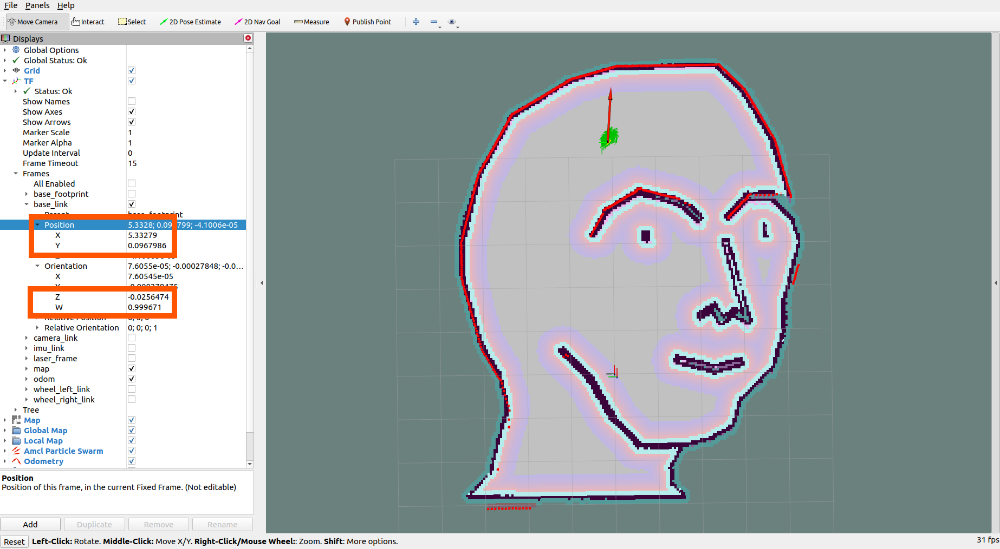
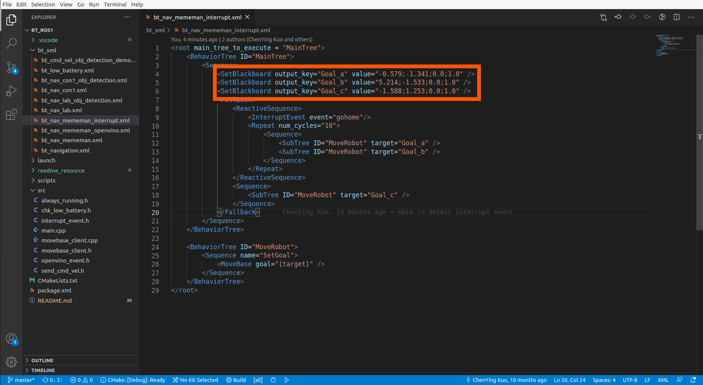

# BT_ros1

Behavior Tree example for ROS 1

# Support ROS version

* melodic
* noetic

# Build up environment

1. git clone the repo.
```
mkdir -p ~/bt_ros1_ws/src
cd ~/bt_ros1_ws/src
git clone https://github.com/Adlink-ROS/BT_ros1.git
```

2. Install dependencies
```
cd ~/bt_ros1_ws
rosdep install --from-paths src --ignore-src -r -y
```

3. Build
```
catkin_make
# If you want to build with OpenVINO support
catkin_make --cmake-args -DBUILD_OPENVINO=ON
```

# Usage

We will run Gazebo with NeuronBot2 and show a simple BT example.
NeuronBot2 supports [melodic](https://github.com/Adlink-ROS/neuronbot2/tree/melodic-devel) & [noetic](https://github.com/Adlink-ROS/neuronbot2/tree/noetic-devel).
Choose the version based on your ROS 1 environment.

The BT example (refer to [bt_nav_mememan_interrupt.xml](bt_xml/bt_nav_mememan_interrupt.xml)) will make NeuronBot2 move between Goal_a and Goal_b.
If receiving `/interrupt_event`, which is `gohome`, then NeuronBot2 will move to Goal_c.

* Open 1st terminal and run mememan world. (ROS 1 environment)
```
source ~/neuronbot2_ros1_ws/devel/setup.bash
export GAZEBO_MODEL_PATH=~/neuronbot2_ros1_ws/src/neuronbot2/neuronbot2_gazebo/models
roslaunch neuronbot2_gazebo neuronbot2_world.launch world_model:=mememan_world.model
```
* Open 2nd terminal and run navigation. (ROS 1 environment)
```
source ~/neuronbot2_ros1_ws/devel/setup.bash
roslaunch neuronbot2_nav bringup.launch map_name:=$HOME/neuronbot2_ros1_ws/src/neuronbot2/neuronbot2_nav/maps/mememan.yaml open_rviz:=true
```
* Open 3rd termainal and run BT. (ROS 1 environment) 
```
source ~/bt_ros1_ws/devel/setup.bash
roslaunch bt_sample bt_sample.launch
```
* Open 4th terminal and pub interrupt event. (ROS 1 environment)
```
rostopic pub /interrupt_event std_msgs/String "gohome"
```

# Note
If you want to get the coordinate for navigation, you can run navigation and listen to the topic /goal_pose or open rviz to monitor tf.

The position and orientation should be put into BT file and the orientation value we use here is Quaternion.

Record X, Y in positoin and Z, W in orientation.


Open xml file in bt_xml and modify robot checkpoint with " X ; Y ; Z ; W " format in SetBlackboard.


If you only have Euler Angle and want to transfer to Quaternion, please refer to online tools, such as https://quaternions.online/
